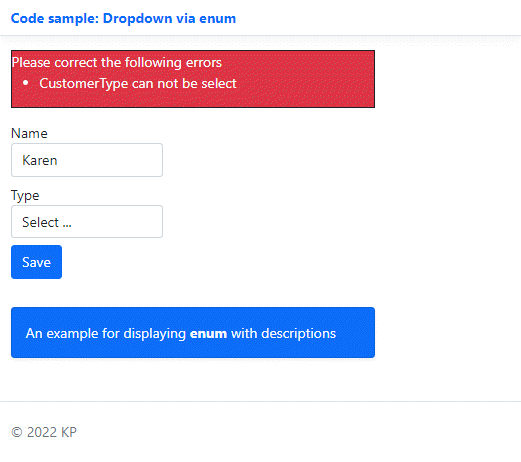

# Enum dropdown sample

Simple example for showing an `enum` selection in a dropdown which is used to compared to what is needed for Windows Forms using a ComboBox.

```csharp
public class Customer
{
    public Guid Id { get; set; }
    [Required]
    public string Name { get; set; }
    [RequiredType(ErrorMessage = "Customer{0} can not be select")]
    public CustomerType Type { get; set; }
    public override string ToString() => Name;
}

public enum CustomerType
{
    [Display(Name = "Select ...")]
    Select,
    [Display(Name = "Private")]
    PrivateSector,
    [Display(Name = "Public")]
    PublicSector
}
```


</br>

