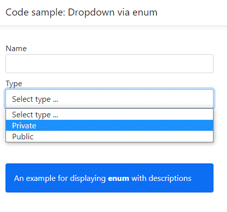

# Enum dropdown sample

Simple example for showing an `enum` selection in a dropdown wich is used to compared to what is needed for Windows Forms using a ComboBox.

```csharp
public class Customer
{
    public Guid Id { get; set; }
    public string Name { get; set; }
    public CustomerType Type { get; set; }
}
public enum CustomerType
{
    [Display(Name = "Private")]
    PrivateSector,

    [Display(Name = "Public")]
    PublicSector
}
```


