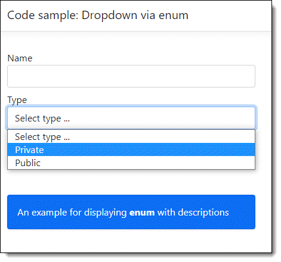
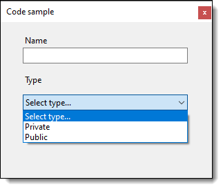

# How to display an enum in WinForms ComboBox or ASP.NET Core Select

This article demonstrates how to display `enum members` using English text rather than each enum member name and there is a comparison to how it’s done with ASP.NET Core which is a good deal easier than in Windows Forms.

## ASP.NET Core

With ASP.NET Core to display enum members in a dropdown we can use [Html.GetEnumSelectList](https://docs.microsoft.com/en-us/dotnet/api/microsoft.aspnetcore.mvc.viewfeatures.htmlhelper.getenumselectlist?view=aspnetcore-6.0)&lt;YourEnum>()

With that in the example below the enum used where `Description` attruibute is used to properly display the text rather than the enum members.

```csharp
public enum CustomerType
{
    [Display(Name = "Private")]
    PrivateSector,
    [Display(Name = "Public")]
    PublicSector
}
```

HTML code

```html
<select asp-for="Type" class="form-control"  asp-items="Html.GetEnumSelectList<CustomerType>()">
    <option>Select type ...</option>
</select>
```

Which gives us the following



## Windows forms


We will use the same model as in the ASP.NET Core sample but remove the Display attruibute with a Description attruibute.

```csharp
public enum CustomerType
{
    [Description("Select type...")]
    Select,
    [Description("Private")]
    PrivateSector,
    [Description("Public")]
    PublicSector
}
```

The following method is used to obtain each enum member value and text description

```csharp
public class EnumHelper
{
    public static List<KeyValuePair<string, Enum>> GetItemsAsDictionary<T>() =>
        Enum.GetValues(typeof(T)).Cast<T>()
            .Cast<Enum>()
            .Select(value => new KeyValuePair<string, Enum>(
                (Attribute.GetCustomAttribute(value.GetType().GetField(value.ToString())!,
                    typeof(DescriptionAttribute)) as DescriptionAttribute)!.Description, value))
            .ToList();

}
```

Then in form shown event, with a ComboBox named TypeComboBox setup DisplayMember to the Key, the text description of the enum than set ValueMember to the actual enum. Now we can set the ComoBox.DataSource.

```csharp
TypeComboBox.DisplayMember = "Key";
TypeComboBox.ValueMember = "Value";
TypeComboBox.DataSource = GetItemsAsDictionary<CustomerType>(); ;
```

To get the selection, in a button click event.

```csharp
Enum.TryParse(TypeComboBox.SelectedValue.ToString(), out CustomerType customerType);

MessageBox.Show(customerType == CustomerType.Select 
    ? "Please make a selection" : $"Selected {customerType}");
```

Downside to this solution is a member for `CustomerType` is needed for prompting for a selection.

